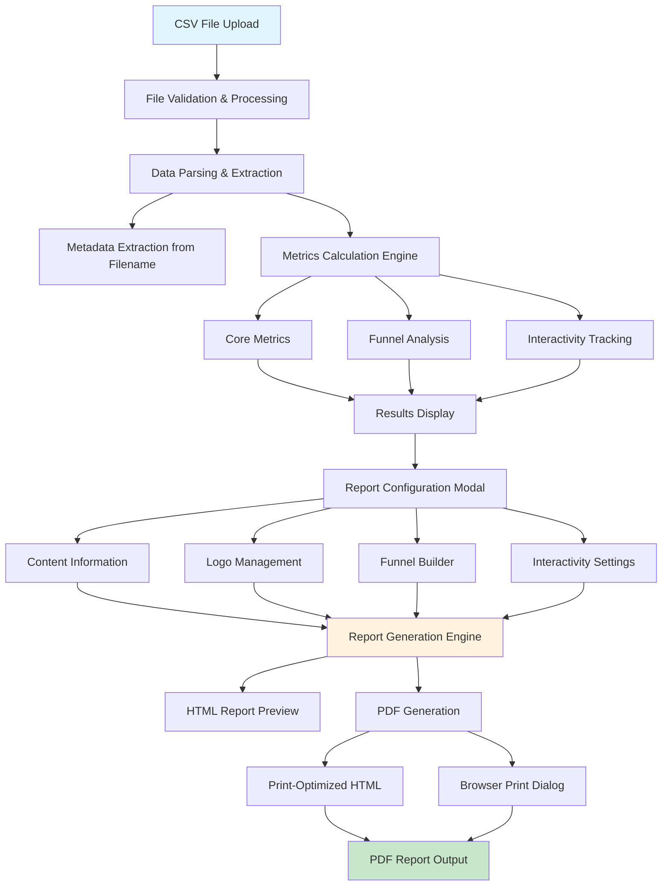

# Analytics Analyzer 📊

A comprehensive web-based analytics tool for processing CSV campaign data, generating interactive visualizations, and creating professional PDF reports with advanced features.

## 🎯 Tool Overview

The Analytics Analyzer is a sophisticated client-side web application designed to process and analyze marketing campaign analytics data. It transforms raw CSV data into meaningful insights through interactive visualizations and generates professional PDF reports with customizable branding.

## 🏗️ Architecture & Data Flow



## 🚀 Key Features

### 📈 Data Processing & Analysis
- **CSV Import**: Drag-and-drop or file selection for CSV uploads
- **Intelligent Parsing**: Automatic column detection and data validation
- **Metadata Extraction**: Campaign information from filename patterns
- **Test Data Filtering**: Automatic exclusion of test user IDs (X001, PH123, OMMATEST)
- **Missing ID Analysis**: Detection and reporting of incomplete data

### 📊 Analytics Capabilities
- **Core Metrics Calculation**:
  - Total/Unique Visitors
  - Total/Unique Impressions  
  - Play counts and completion rates
  - Visit patterns and engagement metrics
- **Funnel Analysis**: Customizable 3-6 step conversion funnels
- **Interactivity Tracking**: Event-based user interaction analysis
- **Date Range Processing**: Automatic date extraction and filtering

### 🎨 Visualization & Reporting
- **Interactive D3.js Charts**: Responsive funnel visualizations
- **Real-time Preview**: Live report preview with customization
- **Professional Branding**: Dual logo support (OmmaVQ + Client)
- **Responsive Design**: Mobile-friendly interface

### 📄 PDF Report Generation
- **Print-to-PDF Technology**: Browser-native PDF generation via print functionality
- **High-Quality Output**: Optimized styling for consistent print results
- **Professional Layout**: A4 format with proper margins and formatting
- **Cross-Browser Compatible**: Works with all modern browsers' print-to-PDF feature

## 💾 Data Structure

### Input CSV Format
The tool expects CSV files with the following column structure:
```csv
uniqueid,thumbnail_count,visit_count,play_count,impression_count,event_count_finished,
first_thumbnail_at,last_thumbnail_at,first_visited_at,last_visited_at,
first_played_at,last_played_at,first_impression_at,last_impression_at,
first_received_at_finished,last_received_at_finished,
[additional interaction columns...]
```

### Filename Conventions
Metadata is automatically extracted from filenames following patterns:
- `CampaignName - DateRange.csv`
- `CampaignName StartDate - EndDate.csv`
- Date formats: `DD_MM_YYYY`, `YYYY-MM-DD`, `DD/MM/YYYY`

### Interaction Tracking Columns
The tool monitors specific interaction events:
- `event_count_answer_correct/wrong`
- `event_count_back_to_home`
- `event_count_replay`
- `event_count_scene[X]_[action]`
- Custom interaction columns (configurable)

## 🛠️ Technical Implementation

### Frontend Stack
- **Pure JavaScript**: No external frameworks, vanilla JS implementation
- **D3.js v7**: Data visualization and chart rendering
- **CropperJS**: Image cropping functionality
- **Material Design Icons**: Consistent iconography
- **Browser Print API**: Native PDF generation through print functionality

### Key Components

#### 1. Data Processing Engine (`script.js:2178-2478`)
```javascript
// Core data processing with validation and filtering
function processData(csvContent, fileName) {
    // CSV parsing, validation, and metadata extraction
    // Automatic column detection and mapping
    // Test user filtering and data cleaning
}
```

#### 2. Metrics Calculation Engine (`script.js:2305-2478`)
```javascript
// Advanced metrics calculation with funnel analysis
function calculateMetrics(lines, columnIndexes) {
    // Core KPI calculations
    // Funnel conversion tracking
    // Interactivity analysis
}
```

#### 3. Report Generation System (`script.js:1197-1503`)
```javascript
// Dynamic HTML report generation with D3.js integration
function generateReportPreview(reportData) {
    // Template-based report assembly
    // Interactive chart embedding
    // Responsive layout generation
}
```

#### 4. PDF Generation Engine (`script.js:1503-1952`)
```javascript
// Browser-native PDF generation via print window
function generatePDF() {
    // Collect and validate report data
    // Create optimized print-ready HTML
    // Open print dialog for PDF generation
}
```

### Configuration System
```javascript
const CONFIG = {
    TEST_USER_IDS: ['X001', 'PH123', 'OMMATEST'],
    INTERACTION_COLUMNS: [...],
    FUNNEL: { MIN_ITEMS: 3, MAX_ITEMS: 6, DEFAULT_ITEMS: 4 },
    NOTIFICATION_DURATION: 4000
};
```

## 📁 Project Structure

```
Analytics Analyzer/
├── index.html              # Main application interface (210 lines)
├── script.js               # Core application logic (2,810 lines)
├── styles.css              # Responsive styling (1,729 lines)
├── README.md               # Documentation
├── img/                    # Image assets
│   ├── OmmaVQ Black.png   # Default company logo
│   └── philip-morris-logo-png-transparent.png
└── Example Data/           # Sample datasets
    ├── AppWards - Monthly Report 01_04_2025 - 30_04_2025.csv (12MB)
    ├── CCI - 2025 Q1 13_05_2025 - 20_05_2025.csv (354KB)
    ├── KadınlarGünü 2025-03-05 Analytics - Sheet1.csv (1.4MB)
    ├── Power Serum GI3 01_02_2025 - 28_02_2025.csv (128KB)
    └── MissingID Data/
        └── missing_ids_CCI_-_2025_Q1.csv (97 records)
```

## 🎯 Usage Guide

### 1. Data Import
1. **Upload CSV**: Drag and drop or select your analytics CSV file
2. **Automatic Processing**: Tool validates format and extracts metadata
3. **Results Display**: View calculated metrics in interactive cards

### 2. Report Creation
1. **Click "Create Report"**: Opens comprehensive report configuration modal
2. **Configure Content**:
   - Enter campaign name, ID, token
   - Set content creation and report dates
   - Upload client logo (auto-cropped to optimal dimensions)

### 3. Customize Analytics
1. **Summary Section**: Set total audience, view calculated impressions
2. **Funnel Builder**: 
   - Adjust funnel steps (3-6 items)
   - Drag-and-drop reordering
   - Custom metric assignment
3. **Interactivity Grid**: Configure tracked user interactions

### 4. Generate Output
1. **Preview Report**: Real-time preview with D3.js visualizations
2. **Generate PDF**: Creates a print-optimized version and opens browser's print dialog for PDF generation

## 🔧 Advanced Configuration

### PDF Print Customization
```javascript
// Customize PDF print output through CSS
const getPrintStyles = () => {
    return `
        @page {
            margin: 0;
            size: A4 portrait;
        }
        
        .report-preview {
            background: white;
            padding: 30px;
            width: 210mm;
            min-height: 297mm;
        }
    `;
};
```

### Custom Interaction Columns
```javascript
// Extend interaction tracking
INTERACTION_COLUMNS: [
    'event_count_answer_correct',
    'event_count_custom_action',
    'event_count_special_interaction'
]
```

## 🌐 Browser Compatibility

| Browser | Version | Status |
|---------|---------|--------|
| Chrome  | 60+     | ✅ Full Support |
| Firefox | 55+     | ✅ Full Support |
| Safari  | 12+     | ✅ Full Support |
| Edge    | 79+     | ✅ Full Support |

## 🚀 Performance Characteristics

- **File Processing**: Handles CSV files up to 12MB efficiently
- **Memory Usage**: Client-side processing with optimized memory management  
- **PDF Generation**: 2-5 seconds for typical reports
- **Real-time Preview**: Instant updates with responsive rendering

## 📊 Sample Data Analysis

The tool includes comprehensive example datasets:
- **Large Campaign**: 12MB file with extensive user tracking
- **Quarterly Reports**: 354KB multi-month analytics
- **Event Campaigns**: 1.4MB special event tracking
- **Missing ID Analysis**: Separate tracking for incomplete data records

## 🔐 Data Privacy & Security

- **Client-Side Processing**: No data transmitted to external servers
- **Local Storage**: Temporary processing only, no persistent storage
- **CORS Compliance**: Cross-origin resource sharing support
- **Input Validation**: Comprehensive data sanitization and validation

## 📈 Future Enhancements

- **Real-time Dashboard**: Live data streaming capabilities
- **Advanced Filtering**: Multi-dimensional data filtering
- **Export Formats**: Excel, PowerPoint, and JSON export options
- **Template System**: Customizable report templates
- **API Integration**: Direct data source connections
- **Collaborative Features**: Multi-user report editing

---

**Built with ❤️ for data-driven marketing analytics**

*Last Updated: June 2025* 